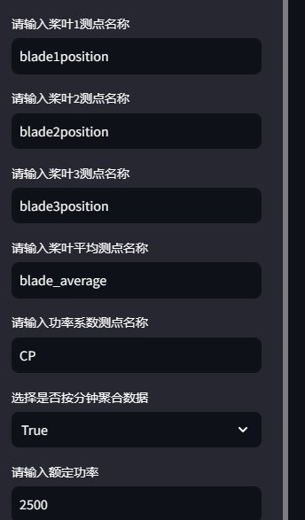

# 简介

**这是一个偏航对风通用调参工具**

偏航系统对风电机组的运行效率和发电量起着至关重要的作用。风向仪对准基准偏差、结冰、接线松动，机舱未准确对北，叶轮转动产生尾流、地形环境等众多因素都可能会造成机组对风偏差。偏航对风偏差一方面会造成机组发电效率损失，另一方面，当出现偏航偏差长期运行，会造成主轴磨损、齿轮箱齿面磨损、机组对中位移等问题，严重影响机组寿命。因此，定期排查风电机组对风偏差，及时对偏差进行矫正，不仅能够提升机组发电性能，提高风电场发电量，还能减少大部件磨损，延长机组使用寿命。

风电场十分关注风机偏航误差情况，希望可以自动化、清晰、定量的监测到每台风机的偏航对风误差，及时进行偏航偏差校正，以减少弃风发电损失，提升设备安全性和风机利用率。

# 原理

通过查看功率-偏航角度散点图，判断风机是否存在较为严重的偏航对风偏差，并进行预警。

正常来讲，功率与偏航对风角度的关系近似于开口向下的抛物线。当风机完全对风，偏航对风角度为0时，风机的功率最大。风向仪对准基准偏差、结冰、接线松动，机舱未准确对北，叶轮转动产生尾流、地形环境等众多因素都可能会造成机组对风偏差，导致当偏航对风夹角显示为0是风机无法完全对风。而风机的控制策略往往为尽可能的在0位置捕捉更多的风能，因此会造成发电量损失。

可以通过分位数回归进行拟合来量化对风偏差的严重程度。

由于风速对功率的影响极大，因此我们对风速进行分仓，以尽可能的排除风速对功率的影响。

最终得到的结果如下图所示

# 前端界面展示及使用说明

## Step 1 上传数据

## Step 2 填写侧边栏的测点名称等（请按照上传的数据的列名填写），并选择是否按照分钟对数据进行聚合

## Step 3 查看数据情况，并设置每个月最少的数量

可以查看每个月的风速-功率散点图，以及数据量，并设置每个月参与计算的最少数据量的门槛

如图当设置最少数据量为1600以上时，可以将2024年1月的数据剔除

## Step 4 缺失值处理

缺失值处理中，主要分为以下两步：

- 1.对于功率缺失的数据，直接进行剔除。
- 2.对于桨叶角度缺失的数据，首先对三个桨叶片角度进行平均，再选择是否进行进行向前填充。

可以从图中看出缺失值处理前后数据的变化

## Step 5 工况处理

工况处理分为5步

- 1.删除所有功率小于0的数据
- 2.删除所有功率大于等于额定功率的数据
- 3.删除所有桨叶片角度大于30的数据
- 4.删除所有限电数据（根据图2选择桨叶片角度的阈值，根据图3查看当前限电使用的策略能否正常使用）
- 5.根据散点图筛选(根据图1选择爬坡阶段风速的最小值和最大值)

从图中可以看到每个月的数据在每一步中被剔除的样本量。

## Step 6 异常数据处理

异常数据处理可以分为3步

* 1.剔除异常跳变数据（可以通过前端界面设置异常跳变的功率阈值）
* 2.根据Cp设置上下限，剔除因风速仪结冰等原因导致的异常数据（通过前端查看Cp分布，并设置上下限）
  这里的Cp值为相对Cp,由$\frac{P}{V^3}$计算得到
* 3.对风速分bin，每个bin区间进行3sigma异常值剔除（通过前端设置进行几次3sigma剔除）

从图中可以看到每个月的数据在每一步中被剔除的样本量。

## Step 7 对风偏差拟合

由于数据质量、数据频次不足等原因，不是每次的拟合结果都有效。

根据前端界面，可以选择拟合结果是否有效的标准。如：

- 最小样本数量
- 最小偏航角度
- 最大偏航角度
- 风速bin区间大小

同样，在拟合时可以选择多种拟合参数。具体参数解释参考[statsmodels.regression.quantile_regression.QuantReg.fit - statsmodels 0.15.0 (+306)](https://www.statsmodels.org/dev/generated/statsmodels.regression.quantile_regression.QuantReg.fit.html#statsmodels.regression.quantile_regression.QuantReg.fit "quantreg.fig()")

最终可以得到拟合结果。可以看到 图中某风机对风偏差较为严重

